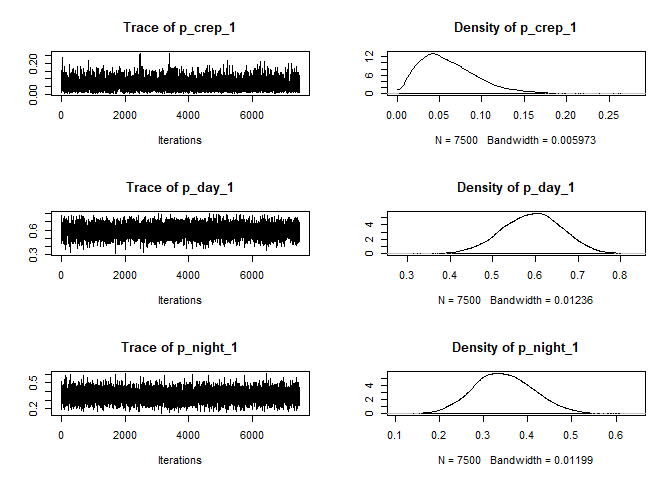
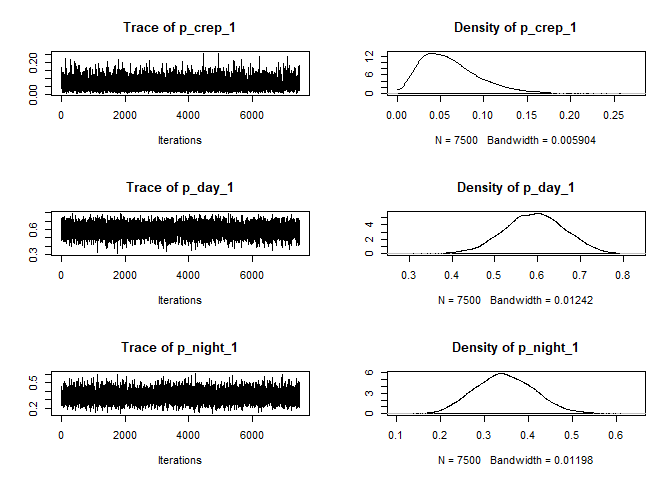
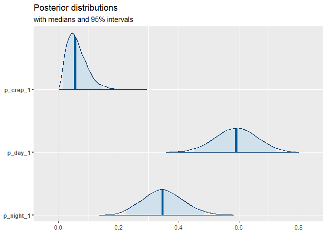
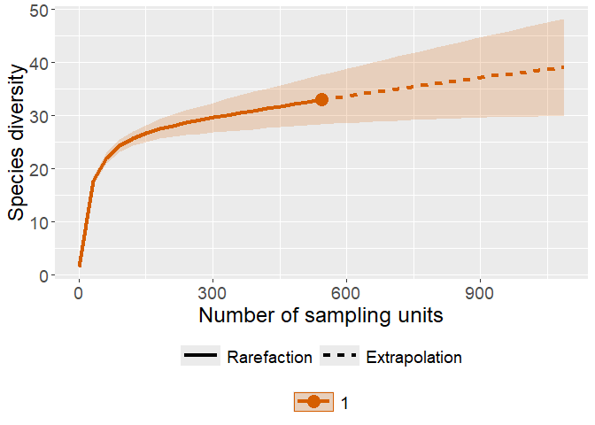
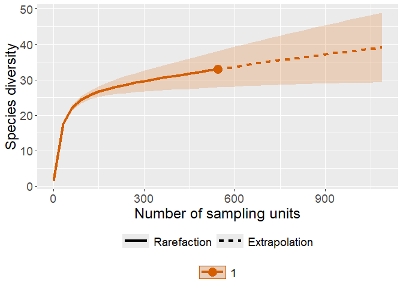

[](https://ci.appveyor.com/project/OscarGOGO/Makurhini)

[](https://lifecycle.r-lib.org/articles/stages.html#experimental)

<!-- README.md is generated from README.Rmd. Please edit that file -->

# **mati R package**

Tools for processing and analyzing camera-trap data in R. The package is
designed to support ecological analyses based on camera-trap data.
***mati*** provides a set of functions to:

- Identify independent camera-trap events

- Estimate sampling effort and capture frequency

- Classify detections into diel periods (twilight, day, night)

- Generate inputs for diversity estimation (e.g. iNEXT)

- Prepare diel-period data for use with Diel.Niche

## Installation

You can install the development version from GitHub:

``` r
install.packages("remotes")
remotes::install_github("YOURUSER/fototrampeoTools")
```

Then load the package:

``` r
library(mati)
```

## **Main functions (overview)**

- `event_independ()` – define independent camera-trap events using a
  temporal threshold.

- `periods_day()` – classify detections as twilight/day/night using sun
  times from suncalc.

- `input_iNEXT()` – generate incidence or frequency data structures for
  iNEXT.

- `capture_frequency()` (or equivalent) – compute standardized capture
  frequencies.

- `assign_MNI_hmm()` – estimate Minimum Number of Individuals (MNI)
  using a simple HMM in space–time.

Below we show a minimal example workflow using some of these functions.

## Example data

In this example we assume you have a camera-trap dataset like:

``` r
datab <- read.csv("G:/Mi unidad/R/Fototrampeo/sipecam_final.csv", header = TRUE)
```

``` r
head(datab)
#>     ID             Carpeta Integridad Station Latitud  Longitud Comunidad
#> 1  436    1_81_1_1499_9785       alta 1499_02 19.4239 -102.1985       NSJ
#> 2  913    1_81_1_1499_9785       alta 1499_02 19.4239 -102.1985       NSJ
#> 3  702    1_81_0_1501_8996      media 1501_01 19.4340 -102.3632      EApo
#> 4  414    1_81_1_1499_9785       alta 1499_02 19.4239 -102.1985       NSJ
#> 5  809    1_81_0_1504_9802      media 1504_03 19.3625 -102.2949 Tancitaro
#> 6 1147 M2_1_81_0_1119_9183      media 1119_01 19.3828 -102.2486       NSJ
#>   Muestreo             Species     ncomun    grupo carnivoro DateTimeOriginal
#> 1    Secas  Accipiter cooperii        ave      Ave        no  7/02/2022 13:22
#> 2    Secas  Accipiter cooperii        ave      Ave        no  7/02/2022 13:22
#> 3    Secas Arremon virenticeps        ave      Ave        no 29/01/2022 15:22
#> 4    Secas Arremon virenticeps        ave      Ave        no 22/01/2022 16:53
#> 5  Lluvias  Atlapetes pileatus        ave      Ave        no 23/06/2022 10:44
#> 6  Lluvias Bassariscus astutus Cacomixtle Mamifero        si 11/09/2022 21:31
#>         Date     Time delta.time.secs delta.time.mins delta.time.hours
#> 1  7/02/2022 13:22:38           24171           402.9              6.7
#> 2  7/02/2022 13:22:38          415922          6932.0            115.5
#> 3 29/01/2022 15:22:34          530591          8843.2            147.4
#> 4 22/01/2022 16:53:31          110749          1845.8             30.8
#> 5 23/06/2022 10:44:19               0             0.0              0.0
#> 6 11/09/2022 21:31:31               0             0.0              0.0
#>   delta.time.days Individuos
#> 1             0.3          1
#> 2             4.8          1
#> 3             6.1          1
#> 4             1.3          1
#> 5             0.0          1
#> 6             0.0         NA
#>                                                         Directory
#> 1    C:/Users/45036829/Documents/SIPECAM/renamed/1_81_1_1499_9785
#> 2    C:/Users/45036829/Documents/SIPECAM/renamed/1_81_1_1499_9785
#> 3    C:/Users/45036829/Documents/SIPECAM/renamed/1_81_0_1501_8996
#> 4    C:/Users/45036829/Documents/SIPECAM/renamed/1_81_1_1499_9785
#> 5    C:/Users/45036829/Documents/SIPECAM/renamed/1_81_0_1504_9802
#> 6 C:/Users/45036829/Documents/SIPECAM/renamed/M2_1_81_0_1119_9183
#>                                               FileName
#> 1        1_81_1_1499_9785__2022-02-07__13-22-38(1).JPG
#> 2        1_81_1_1499_9785__2022-02-07__13-22-38(1).JPG
#> 3        1_81_0_1501_8996__2022-01-29__15-22-34(1).JPG
#> 4        1_81_1_1499_9785__2022-01-22__16-53-31(1).JPG
#> 5        1_81_0_1504_9802__2022-06-23__10-44-19(1).JPG
#> 6 M2_1_81_0_1119_9183-TAG__2022-09-11__21-31-31(1).JPG
```

**Typical columns:**

- Station – camera station ID

- Species – species identifier

- Date – date (e.g. “23/02/2023”)

- Time – time (e.g. “06:30:00”)

- Latitud, Longitud – coordinates in decimal degrees

1.  **Identify independent events**

``` r
ev <- event_independ(
input = datab,
station_field = "Station",
species_field = "Species",
date_field = "Date",
date_format = "%d/%m/%Y",
time_field = "Time",
independent_time = 1,
independent_units = "hours"
)

head(ev)
#>     ID             Carpeta Integridad Station Latitud  Longitud Comunidad
#> 1 1147 M2_1_81_0_1119_9183      media 1119_01 19.3828 -102.2486       NSJ
#> 2  593    1_81_0_1119_9183      media 1119_01 19.3828 -102.2485       NSJ
#> 3  594    1_81_0_1119_9183      media 1119_01 19.3828 -102.2485       NSJ
#> 4  595    1_81_0_1119_9183      media 1119_01 19.3828 -102.2485       NSJ
#> 5  596    1_81_0_1119_9183      media 1119_01 19.3828 -102.2485       NSJ
#> 6  597    1_81_0_1119_9183      media 1119_01 19.3828 -102.2485       NSJ
#>   Muestreo             Species         ncomun    grupo carnivoro
#> 1  Lluvias Bassariscus astutus     Cacomixtle Mamifero        si
#> 2    Secas          Bos taurus Vaca domestica Mamifero        no
#> 3    Secas          Bos taurus Vaca domestica Mamifero        no
#> 4    Secas          Bos taurus Vaca domestica Mamifero        no
#> 5    Secas          Bos taurus Vaca domestica Mamifero        no
#> 6    Secas          Bos taurus Vaca domestica Mamifero        no
#>   DateTimeOriginal       Date     Time delta.time.secs delta.time.mins
#> 1 11/09/2022 21:31 11/09/2022 21:31:31               0             0.0
#> 2 14/11/2021 17:55 14/11/2021 17:55:44               0             0.0
#> 3  15/11/2021 1:51 15/11/2021  1:51:17           28533           475.6
#> 4 16/11/2021 17:00 16/11/2021 17:00:08          140931          2348.8
#> 5  17/11/2021 9:56 17/11/2021  9:56:10           60962          1016.0
#> 6  20/11/2021 8:13 20/11/2021  8:13:18          253028          4217.1
#>   delta.time.hours delta.time.days Individuos
#> 1              0.0             0.0         NA
#> 2              0.0             0.0         NA
#> 3              7.9             0.3         NA
#> 4             39.1             1.6         NA
#> 5             16.9             0.7         NA
#> 6             70.3             2.9         NA
#>                                                         Directory
#> 1 C:/Users/45036829/Documents/SIPECAM/renamed/M2_1_81_0_1119_9183
#> 2    C:/Users/45036829/Documents/SIPECAM/renamed/1_81_0_1119_9183
#> 3    C:/Users/45036829/Documents/SIPECAM/renamed/1_81_0_1119_9183
#> 4    C:/Users/45036829/Documents/SIPECAM/renamed/1_81_0_1119_9183
#> 5    C:/Users/45036829/Documents/SIPECAM/renamed/1_81_0_1119_9183
#> 6    C:/Users/45036829/Documents/SIPECAM/renamed/1_81_0_1119_9183
#>                                               FileName
#> 1 M2_1_81_0_1119_9183-TAG__2022-09-11__21-31-31(1).JPG
#> 2        1_81_0_1119_9183__2021-11-14__17-55-44(1).JPG
#> 3        1_81_0_1119_9183__2021-11-15__01-51-17(1).JPG
#> 4        1_81_0_1119_9183__2021-11-16__17-00-08(1).JPG
#> 5        1_81_0_1119_9183__2021-11-17__09-56-10(1).JPG
#> 6        1_81_0_1119_9183__2021-11-20__08-13-18(1).JPG
```

Here, two detections of the same species at the same station within 1
hour are treated as belonging to the same event.

2.  **Classify detections into diel periods**

We can classify each detection as twilight, day, or night using
periods_day(). This function uses the suncalc package to compute dawn,
sunrise, sunset, and dusk from dates and coordinates.

``` r
pd <- periods_day(
input = ev,
species_field = "Species",
date_field = "Date",
date_format = "%d/%m/%Y",
time_field = "Time",
tz = "America/Mexico_City",
lat = "Latitud",
long = "Longitud"
)
#>   |                                                                              |                                                                      |   0%  |                                                                              |==                                                                    |   3%  |                                                                              |====                                                                  |   6%  |                                                                              |======                                                                |   9%  |                                                                              |========                                                              |  12%  |                                                                              |===========                                                           |  15%  |                                                                              |=============                                                         |  18%  |                                                                              |===============                                                       |  21%  |                                                                              |=================                                                     |  24%  |                                                                              |===================                                                   |  27%  |                                                                              |=====================                                                 |  30%  |                                                                              |=======================                                               |  33%  |                                                                              |=========================                                             |  36%  |                                                                              |============================                                          |  39%  |                                                                              |==============================                                        |  42%  |                                                                              |================================                                      |  45%  |                                                                              |==================================                                    |  48%  |                                                                              |====================================                                  |  52%  |                                                                              |======================================                                |  55%  |                                                                              |========================================                              |  58%  |                                                                              |==========================================                            |  61%  |                                                                              |=============================================                         |  64%  |                                                                              |===============================================                       |  67%  |                                                                              |=================================================                     |  70%  |                                                                              |===================================================                   |  73%  |                                                                              |=====================================================                 |  76%  |                                                                              |=======================================================               |  79%  |                                                                              |=========================================================             |  82%  |                                                                              |===========================================================           |  85%  |                                                                              |==============================================================        |  88%  |                                                                              |================================================================      |  91%  |                                                                              |==================================================================    |  94%  |                                                                              |====================================================================  |  97%  |                                                                              |======================================================================| 100%
```

Raw table with new columns Period and Time_period

``` r
head(pd$raw_table)
#>        ID             Carpeta Integridad Station Latitud  Longitud Comunidad
#> 509   436    1_81_1_1499_9785       alta 1499_02 19.4239 -102.1985       NSJ
#> 510   414    1_81_1_1499_9785       alta 1499_02 19.4239 -102.1985       NSJ
#> 734   702    1_81_0_1501_8996      media 1501_01 19.4340 -102.3632      EApo
#> 1042  809    1_81_0_1504_9802      media 1504_03 19.3625 -102.2949 Tancitaro
#> 1    1147 M2_1_81_0_1119_9183      media 1119_01 19.3828 -102.2486       NSJ
#> 44     90    1_81_0_1119_8996      media 1119_02 19.3828 -102.2450       NSJ
#>      Muestreo             Species     ncomun    grupo carnivoro
#> 509     Secas  Accipiter cooperii        ave      Ave        no
#> 510     Secas Arremon virenticeps        ave      Ave        no
#> 734     Secas Arremon virenticeps        ave      Ave        no
#> 1042  Lluvias  Atlapetes pileatus        ave      Ave        no
#> 1     Lluvias Bassariscus astutus Cacomixtle Mamifero        si
#> 44      Secas Bassariscus astutus Cacomixtle Mamifero        si
#>      DateTimeOriginal       Date     Time delta.time.secs delta.time.mins
#> 509   7/02/2022 13:22 07/02/2022 13:22:38           24171           402.9
#> 510  22/01/2022 16:53 22/01/2022 16:53:31          110749          1845.8
#> 734  29/01/2022 15:22 29/01/2022 15:22:34          530591          8843.2
#> 1042 23/06/2022 10:44 23/06/2022 10:44:19               0             0.0
#> 1    11/09/2022 21:31 11/09/2022 21:31:31               0             0.0
#> 44   28/11/2021 20:41 28/11/2021 20:41:06               0             0.0
#>      delta.time.hours delta.time.days Individuos
#> 509               6.7             0.3          1
#> 510              30.8             1.3          1
#> 734             147.4             6.1          1
#> 1042              0.0             0.0          1
#> 1                 0.0             0.0         NA
#> 44                0.0             0.0         NA
#>                                                            Directory
#> 509     C:/Users/45036829/Documents/SIPECAM/renamed/1_81_1_1499_9785
#> 510     C:/Users/45036829/Documents/SIPECAM/renamed/1_81_1_1499_9785
#> 734     C:/Users/45036829/Documents/SIPECAM/renamed/1_81_0_1501_8996
#> 1042    C:/Users/45036829/Documents/SIPECAM/renamed/1_81_0_1504_9802
#> 1    C:/Users/45036829/Documents/SIPECAM/renamed/M2_1_81_0_1119_9183
#> 44      C:/Users/45036829/Documents/SIPECAM/renamed/1_81_0_1119_8996
#>                                                  FileName Period
#> 509         1_81_1_1499_9785__2022-02-07__13-22-38(1).JPG    day
#> 510         1_81_1_1499_9785__2022-01-22__16-53-31(1).JPG    day
#> 734         1_81_0_1501_8996__2022-01-29__15-22-34(1).JPG    day
#> 1042        1_81_0_1504_9802__2022-06-23__10-44-19(1).JPG    day
#> 1    M2_1_81_0_1119_9183-TAG__2022-09-11__21-31-31(1).JPG  night
#> 44          1_81_0_1119_8996__2021-11-28__20-41-06(1).JPG  night
#>                  Time_period
#> 509  Between 07:22 and 18:45
#> 510  Between 07:26 and 18:36
#> 734  Between 07:26 and 18:41
#> 1042 Between 07:13 and 20:31
#> 1    Between 20:18 and 07:15
#> 44   Between 18:34 and 06:42
```

Counts of detections per species and period (twilight, day, night)

``` r
pd$period_table
#>                          twilight day night
#> Accipiter cooperii              0   1     0
#> Arremon virenticeps             0   2     0
#> Atlapetes pileatus              0   1     0
#> Bassariscus astutus             0   0    22
#> Bos taurus                     11 148    37
#> Buteo jamaicensis               0   1     0
#> Canis latrans                   1  30    14
#> Canis lupus familiaris          1   7     1
#> Catharus sp                     0  32     0
#> Conepatus leuconotus            1   2    28
#> Cricetido                       2   0   136
#> Cynanthus latirostris           0   1     0
#> Dasypus novemcinctus            0   0    36
#> Dendrortyx macroura             0  39     0
#> Didelphis virginiana            2   9   175
#> Equus caballus                  0   5     6
#> Geococcyx                       0   1     0
#> Leopardus pardalis              0   1     8
#> Lynx rufus                      0  11     6
#> Mephitis macroura               2   0    32
#> Nasua narica                    5   9    14
#> Odocoileus virginianus          2  28    16
#> Ortalis poliocephala            0   1     0
#> Pecari tajacu                   0   2     6
#> Pitangus sulphuratus            0   1     0
#> Procyon lotor                   0   0     7
#> Puma concolor                   1   6     5
#> Sciurus aureogaster             1  74     1
#> Spilogale angustifrons          0   0    16
#> Sylvilagus cunicularius         2  11    48
#> Sylvilagus floridanus           1   2     8
#> Sylvilagus sp                   0   6    11
#> Urocyon cinereoargenteus        1   1     3
```

The period_table can be used directly as input for Diel.Niche:

``` r
library(Diel.Niche)
library(coda)
library(bayesplot)
```

Example for one species:

``` r
y <- as.matrix(pd$period_table["Odocoileus virginianus", ])

out <- diel.fit(
y = y,
hyp.set = hyp.sets("Traditional"),
post.fit = TRUE,
n.chains = 3,
n.mcmc = 3000,
burnin = 500
)
#> The most supported model is: 
#>  Cathemeral (Traditional)

out$bf.table
#>    Prior  Posterior
#> D   0.25 0.01458329
#> N   0.25 0.00000000
#> CR  0.25 0.00000000
#> C   0.25 0.98541671
```

Plot our parameter chains:

``` r
plot(coda::as.mcmc(out$post.samp.ms.model))
```



Posterior probabilities of activity in the three diel periods:

``` r
plot_title <- ggplot2::ggtitle("Posterior distributions",
                               "with medians and 95% intervals")
bayesplot::mcmc_areas(out$post.samp.ms.model, prob = 0.95) + plot_title
```



or Using ggplot2:

``` r
library(ggplot2)

plot(0,xlim=c(0,1),ylim=c(0,12),ylab="Probability Density", xlab="Probability of Activity",
     main="Virginia Opossum \n Winter 2019")
polygon(density(out$post.samp.ms.model[,1]), col = "#A73030FF")
polygon(density(out$post.samp.ms.model[,2]), col = "#EFC000FF")
polygon(density(out$post.samp.ms.model[,3]), col = "#0073C2FF")
legend("topright", legend=c("P(twilight)","P(daytime)","P(nighttime)"),lwd=8,
       col=c("#A73030FF","#EFC000FF","#0073C2FF"))
```



3.  **Generate iNEXT input**

`input_iNEXT()` prepares incidence or frequency data structures
compatible with iNEXT:

``` r
library(iNEXT)
```

Incidence raw format (presence/absence by sampling unit, effort = days)

``` r
inext_raw <- input_iNEXT(
input = datab,
effort = "days",
species_field = "Species",
date_field = "Date",
date_format = "%d/%m/%Y",
type = "raw"
)

out_raw <- iNEXT(inext_raw, q = 0, datatype = "incidence_raw")
ggiNEXT(out_raw, type = 1)
```



For a frequency-based representation:

``` r
inext_freq <- input_iNEXT(
input = datab,
effort = "days",
species_field = "Species",
assemblages = "Muestreo", # e.g. sampling season/category
date_field = "Date",
date_format = "%d/%m/%Y",
type = "frequency"
)

out_freq <- iNEXT(inext_freq, q = 0, datatype = "incidence_freq")
ggiNEXT(out_freq, type = 1)
```



4.  **Estimating MNI with assign_MNI_hmm()**

If your data include coordinates and you want to estimate a Minimum
Number of Individuals (MNI) using a space–time model:

``` r
mni_res <- assign_MNI_hmm(
data = ev,
station_field = "Station",
species_col = "Species",
date_field = "Date",
date_format = "%d/%m/%Y",
time_field = "Time",
tz = "UTC",
species_filter = "Odocoileus virginianus",
lat = "Latitud",
long = "Longitud",
alpha = 300, # spatial scale (m)
dt = 1, # time step (hours)
alpha_sensitivity = seq(200, 10000, 200), # optional sensitivity analysis
min_prob = 0.1
)
```

``` r
mni_res$MNI
#>                  species MNI alpha dt min_prob
#> 1 Odocoileus virginianus   8   300  1      0.1
```

``` r
head(mni_res$data_with_ids)
#>        ID          Carpeta Integridad Station Latitud  Longitud Comunidad
#> 901   764 1_81_0_1503_9381      media 1503_01 19.4079 -102.4291 Tancitaro
#> 721  1964 1_81_1_1500_9862       alta 1500_05 19.4493 -102.2333       NSJ
#> 702   490 1_81_1_1500_9617       alta 1500_04 19.4470 -102.2357       NSJ
#> 902   776 1_81_0_1503_9381      media 1503_01 19.4079 -102.4291 Tancitaro
#> 903   784 1_81_0_1503_9381      media 1503_01 19.4079 -102.4291 Tancitaro
#> 1018  173 1_81_0_1503_0058      media 1503_05 19.4070 -102.4233 Tancitaro
#>      Muestreo                Species ncomun    grupo carnivoro DateTimeOriginal
#> 901     Secas Odocoileus virginianus Venado Mamifero           14/12/2021 18:46
#> 721     Secas Odocoileus virginianus Venado Mamifero           20/12/2021 18:25
#> 702     Secas Odocoileus virginianus Venado Mamifero            24/12/2021 9:36
#> 902     Secas Odocoileus virginianus Venado Mamifero            27/12/2021 9:44
#> 903     Secas Odocoileus virginianus Venado Mamifero           27/12/2021 19:33
#> 1018    Secas Odocoileus virginianus Venado Mamifero             7/01/2022 9:06
#>            Date                Time delta.time.secs delta.time.mins
#> 901  14/12/2021 2021-12-14 18:46:34               0             0.0
#> 721  20/12/2021 2021-12-20 18:25:32               0             0.0
#> 702  24/12/2021 2021-12-24 09:36:01               0             0.0
#> 902  27/12/2021 2021-12-27 09:44:29          122046          2034.1
#> 903  27/12/2021 2021-12-27 19:33:57              16             0.3
#> 1018 07/01/2022 2022-01-07 09:06:20               0             0.0
#>      delta.time.hours delta.time.days Individuos
#> 901               0.0             0.0         NA
#> 721               0.0             0.0         NA
#> 702               0.0             0.0         NA
#> 902              33.9             1.4         NA
#> 903               0.0             0.0         NA
#> 1018              0.0             0.0         NA
#>                                                         Directory
#> 901  C:/Users/45036829/Documents/SIPECAM/renamed/1_81_0_1503_9381
#> 721  C:/Users/45036829/Documents/SIPECAM/renamed/1_81_1_1500_9862
#> 702  C:/Users/45036829/Documents/SIPECAM/renamed/1_81_1_1500_9617
#> 902  C:/Users/45036829/Documents/SIPECAM/renamed/1_81_0_1503_9381
#> 903  C:/Users/45036829/Documents/SIPECAM/renamed/1_81_0_1503_9381
#> 1018 C:/Users/45036829/Documents/SIPECAM/renamed/1_81_0_1503_0058
#>                                           FileName indiv_id prob_last_ind
#> 901  1_81_0_1503_9381__2021-12-14__18-46-34(1).JPG        1  1.000000e+00
#> 721  1_81_1_1500_9862__2021-12-20__18-25-32(1).JPG        2  4.297053e-28
#> 702  1_81_1_1500_9617__2021-12-24__09-36-01(1).JPG        2  2.195745e-01
#> 902  1_81_0_1503_9381__2021-12-27__09-44-29(1).JPG        1  5.000000e-01
#> 903  1_81_0_1503_9381__2021-12-27__19-33-57(4).JPG        1  5.517182e-01
#> 1018 1_81_0_1503_0058__2022-01-07__09-06-20(1).JPG        1  5.000000e-01
#>      prob_new_ind
#> 901     1.0000000
#> 721     1.0000000
#> 702     0.7804255
#> 902     0.5000000
#> 903     0.4482818
#> 1018    0.5000000
```

If alpha_sensitivity is provided, the function can additionally plot how
the MNI varies with the spatial scale parameter.

``` r
mni_res$`Plot MNI vs α`
```


### **Dependencies**

- The package relies on several commonly used R packages, including:

- suncalc – sun times (dawn, sunrise, sunset, dusk)

- dplyr – data wrangling

- lubridate – date–time handling

- ggplot2 – plotting

- iNEXT – diversity estimation

- Diel.Niche – diel niche modeling (optional, downstream)

- Make sure these are listed in DESCRIPTION under Imports or Suggests.

### Contributing

Issues and pull requests are welcome! Please use the GitHub issue
tracker to report bugs, request features, or discuss ideas.
